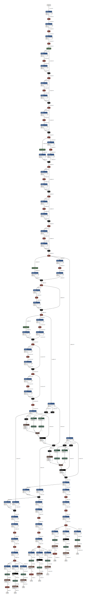

# RetinaFaceJS
Client-side RetinaFace inference in pure JavaScript

### Expected Output
```js
score = 0.8545975089073181

bbox = [
  784.1500574707985,
  340.05089313983916,
  1251.61122931242,
  1101.391042613983
]

kps = [
  [
    946.5707664012908,
    622.0731607049703
  ],
  [
    1156.4569529414177,
    621.0552004873753
  ],
  [
    1076.9043676435947,
    796.0947577297687
  ],
  [
    933.2040783345699,
    871.1082710981368
  ],
  [
    1152.535089123249,
    868.6652949213981
  ]
]
```

### Graph

